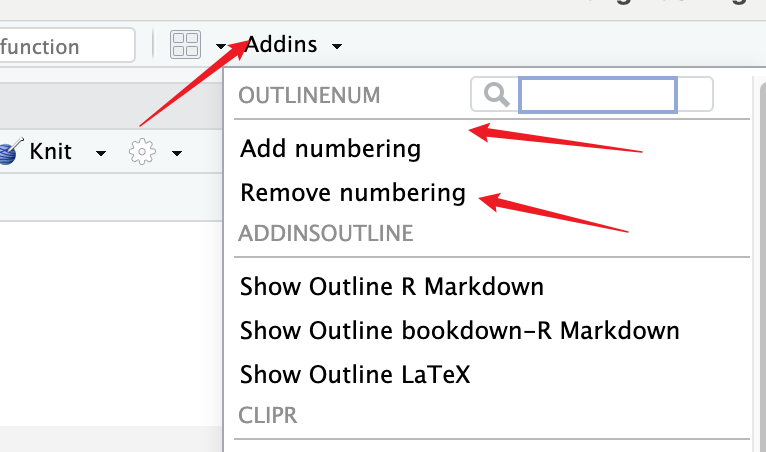

# RStudio Addin: OutlineNum

**OutlineNum** is an RStudio addin for adding and removing numbering from headers/outline in your R Markdown.

## Features

- Easily add or remove numbering from headers.
- Supports multiple levels of headers.
- Works with R Markdown and plain text documents.

## Installation

OutlineNum is currently available for installation via GitHub. You can install it using the following command:

```R
remotes::install_github("callAgene/OutlineNum")
```

## Usage
To use the OutlineNum addin, please follow these steps:

- Open RStudio and load your document.

- Select <span style="color: red; font-weight: bold;">all</span> the text in your document by pressing Ctrl+A (Windows/Linux) or Command+A (macOS).

- Navigate to the "Addins" menu in RStudio.


- Choose either "Add numbering" or "Remove numbering" from the list of available addins.


Your document's headers will be numbered or have numbering removed based on your selection.


